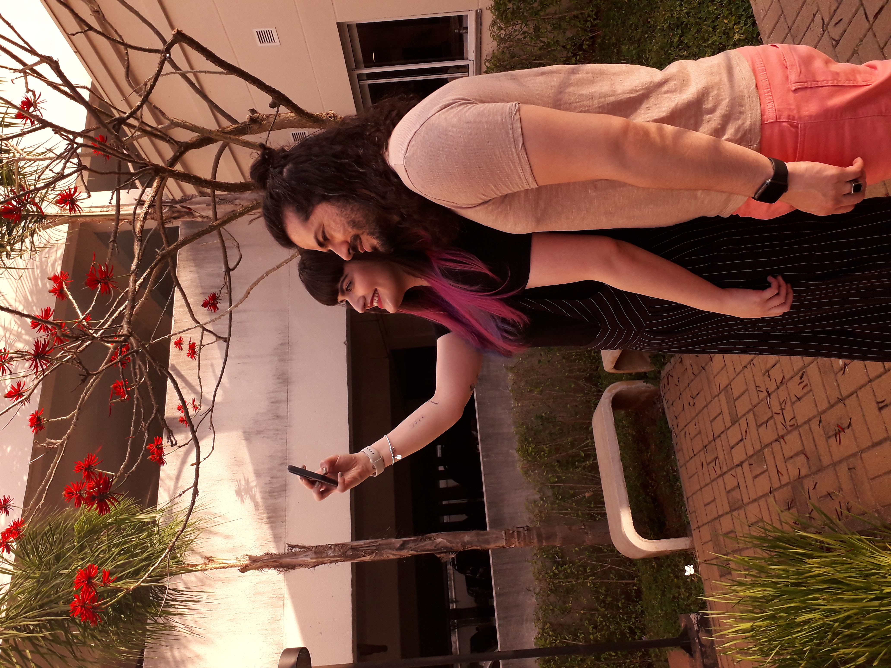
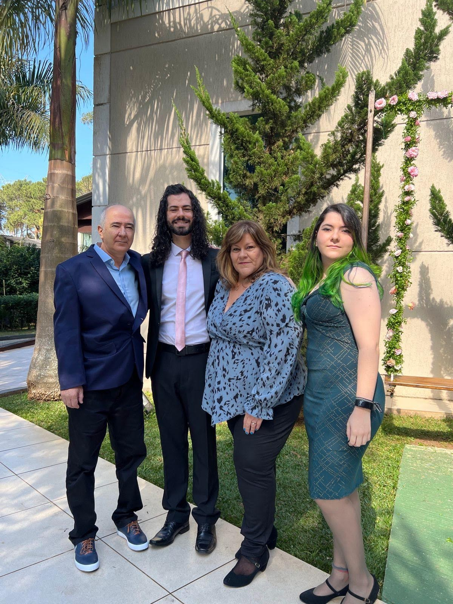
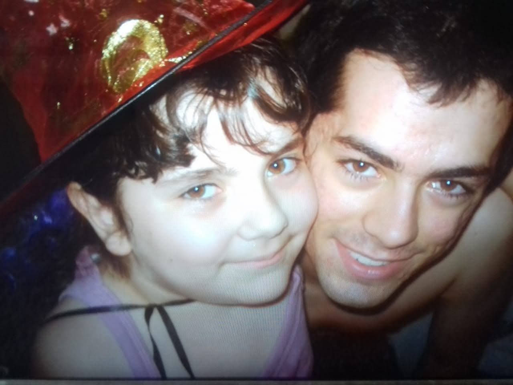

*Atenção*
Nesse projeto os códigos estão uma bagunça (eu podia ter organizado mais dexei assim)
Ele não foi feito profisonalmente (talvez tenha erros ou falte algo mais estou ciente disso),
e foi apenas por diversão e testes

- Utilizar o Live Server kkkk
- Boa sorte pra ver o *Css* pois etá uma *Bagunça* enorme kkkkkk

*Anotações*
//// Faz a rolagem para o topo
 window.scrollTo(0, 0);

/*body {
    background-size: 1000% 1000%;
    
    animation: gradient 20s linear infinite;
    background-color: #000;

    background-image: url('star.png');
    background-repeat: repeat;

    display: grid;
    place-items: center;
    height: 100vh;
  }

@keyframes gradient {
	0% {
        background-position: 0 0;
    }
    100% {
        background-position: 0 100%;
    }
}*/

/*
.screen1 span{
    font-family: 'Roboto', sans-serif;
    font-weight: bold;
   
    
}
     Bora lá!
 */

/*#next{

    border: none;
    padding: 1.6rem  6.2rem; 
    background: #FF9500;
    border-radius: .5rem;

    font-family: 'Roboto Condensed', sans-serif;
    color: #FFFFFF;
    font-size: 3.5rem;
   

    cursor:pointer;

    transition: background .3s;

}*/

        

            

            
            
            
            
            
            
            
            
        

          

//você é um exemplo para mim 